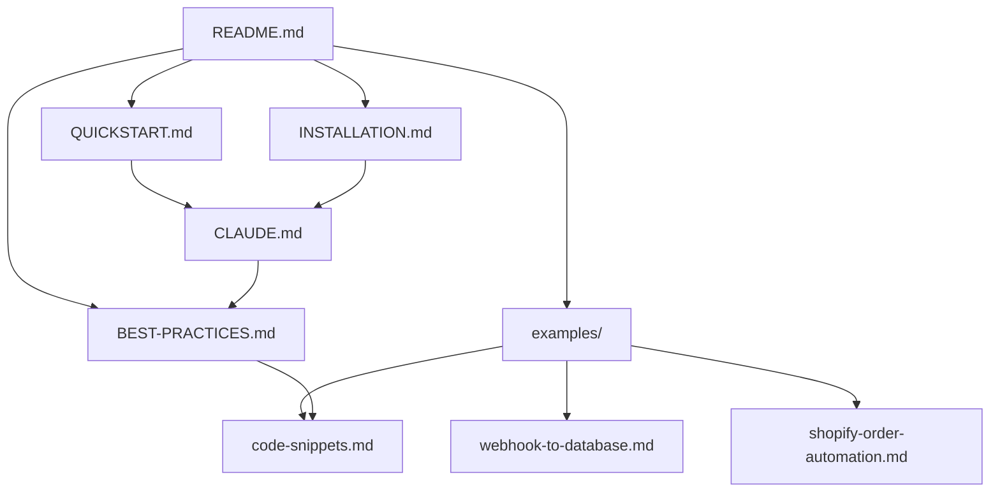

# 📁 Structure du Projet N8N Consultant

Documentation complète de la structure du projet et du rôle de chaque fichier.

## 🌳 Arborescence

```
N8N-Consultant/
├── 📄 CLAUDE.md                  # Configuration principale du consultant
├── 📄 README.md                  # Vue d'ensemble du projet
├── 📄 QUICKSTART.md              # Guide de démarrage rapide (5 min)
├── 📄 INSTALLATION.md            # Guide d'installation détaillé
├── 📄 BEST-PRACTICES.md          # Meilleures pratiques N8N
├── 📄 PROJECT-STRUCTURE.md       # Ce fichier - Documentation de la structure
│
├── 🔧 setup.sh                   # Script d'installation automatique
├── ⚙️  mcp-config.json            # Configuration MCP template
├── 🚫 .gitignore                 # Fichiers à ignorer dans Git
│
└── 📂 examples/                  # Exemples et templates
    ├── webhook-to-database.md            # Workflow webhook complet
    ├── shopify-order-automation.md       # Automatisation e-commerce
    └── code-snippets.md                  # Bibliothèque de code réutilisable
```

---

## 📄 Description des Fichiers

### 🎯 Fichiers Principaux

#### `CLAUDE.md` ⭐️ FICHIER CLÉ
**Rôle** : Configuration et instructions pour Claude

**Contenu** :
- 🤖 Définition du rôle : Expert consultant N8N
- 🛠️ Configuration MCP Server
- 🎨 Skills disponibles (`/n8n-workflow`, `/n8n-optimize`, etc.)
- 📐 Principes de conception
- 🎯 Méthodologie de travail
- 📊 Output attendu

**Utilisation** :
- Chargé automatiquement par Claude Code
- Transforme Claude en expert N8N
- Définit le comportement et les capacités

**À modifier si** :
- Vous voulez ajouter de nouvelles skills
- Vous voulez changer la méthodologie
- Vous voulez adapter les best practices

---

#### `README.md` 📖
**Rôle** : Documentation d'entrée du projet

**Contenu** :
- Vue d'ensemble du projet
- Installation rapide
- Skills disponibles
- Cas d'usage typiques
- Ressources et liens

**Public** : Tous les utilisateurs (première lecture)

---

#### `QUICKSTART.md` ⚡
**Rôle** : Guide de démarrage ultra-rapide

**Contenu** :
- Installation express (5 min)
- Premiers pas concrets
- Exemples de prompts
- Tips et astuces
- Troubleshooting rapide

**Public** : Utilisateurs pressés ou débutants

**Utilisez-le pour** :
- Démarrer immédiatement
- Tester le concept rapidement
- Premiers workflows simples

---

#### `INSTALLATION.md` 🔧
**Rôle** : Guide d'installation complet et détaillé

**Contenu** :
- Prérequis détaillés
- Installation pas à pas
- Configuration MCP Server
- Configuration multi-environnements
- Dépannage approfondi
- Sécurité et best practices

**Public** : Installation en production ou configuration avancée

**Utilisez-le pour** :
- Setup production
- Configuration complexe (multi-env)
- Résolution de problèmes d'installation

---

#### `BEST-PRACTICES.md` 📚
**Rôle** : Guide complet des meilleures pratiques N8N

**Contenu** :
- ✅ Principes fondamentaux (KISS, DRY, Fail Fast)
- 🏗️ Architecture des workflows (5 patterns)
- 🚨 Gestion des erreurs (3 niveaux)
- ⚡ Performance & optimisation
- 🔒 Sécurité
- 🧪 Testing & debugging
- 📝 Documentation
- 🎨 Patterns courants
- ✅ Checklist de production

**Public** : Développeurs N8N intermédiaires à avancés

**Utilisez-le pour** :
- Concevoir des workflows robustes
- Auditer des workflows existants
- Former une équipe
- Référence quotidienne

---

### 🔧 Fichiers de Configuration

#### `setup.sh` 🚀
**Rôle** : Script d'installation automatique

**Fonctionnalités** :
- ✅ Vérification des prérequis (Node.js, npx)
- ✅ Test du MCP Server N8N
- ✅ Détection du fichier de config Claude
- ✅ Configuration interactive
- ✅ Test de connexion N8N
- ✅ Récapitulatif et next steps

**Usage** :
```bash
chmod +x setup.sh
./setup.sh
```

**Avantages** :
- Installation guidée
- Détection automatique
- Tests intégrés
- Gain de temps

---

#### `mcp-config.json` ⚙️
**Rôle** : Template de configuration MCP

**Contenu** :
```json
{
  "mcpServers": {
    "n8n": {
      "command": "npx",
      "args": ["-y", "@n8n/mcp-server"],
      "env": {}
    }
  }
}
```

**Utilisation** :
- Template à copier dans `~/.claude/claude_desktop_config.json`
- Référence pour configuration manuelle
- Base pour configurations avancées

---

#### `.gitignore` 🚫
**Rôle** : Fichiers à exclure du versioning Git

**Protège** :
- 🔑 API keys et credentials
- 📝 Logs et fichiers temporaires
- ⚙️ Configurations locales sensibles
- 💻 Fichiers spécifiques OS/IDE

**Important** : Toujours vérifier avant de commit !

---

### 📂 Dossier Examples

#### `examples/webhook-to-database.md` 🌐
**Type** : Workflow complet documenté

**Cas d'usage** : Pipeline webhook → validation → transformation → database

**Contenu** :
- Architecture détaillée
- Configuration de chaque node
- Code JavaScript complet
- Best practices implémentées
- Test cases
- Optimisations possibles

**Apprenez** :
- Validation robuste des données
- Gestion d'erreurs avec Error Trigger
- Transformation de données
- Sécurité webhook

---

#### `examples/shopify-order-automation.md` 🛒
**Type** : Workflow e-commerce avancé

**Cas d'usage** : Automatisation complète du traitement de commandes

**Contenu** :
- Workflow multi-étapes complexe
- Intégrations multiples (Shopify, Stripe, HubSpot, Slack)
- Branching conditionnel
- Notifications intelligentes
- Calcul ROI

**Apprenez** :
- Architecture complexe
- Intégrations multi-services
- Business logic avancée
- Production-ready workflows

---

#### `examples/code-snippets.md` 💻
**Type** : Bibliothèque de code réutilisable

**Catégories** :
- ✅ Validation de données (email, phone, URL)
- 🔄 Transformation de données (mapping, flatten, slugify)
- 🚨 Gestion des erreurs (wrapper, retry logic)
- 🔁 Retry avec exponential backoff
- 🌐 API Helpers (rate limiting, pagination, auth)
- 📅 Date & Time (formatting, diff, calculations)
- 📝 String manipulation (slugify, truncate, extract)
- 📊 Array operations (dedupe, group, sort, batch)

**Utilisation** :
- Copier-coller dans vos Function nodes
- Adapter à vos besoins
- Base pour vos propres snippets

**Gain de temps** : 70%+ sur les fonctions courantes

---

## 🎯 Parcours Utilisateur Recommandé

### 🆕 Débutant N8N
```
1. QUICKSTART.md          (5 min)  → Installation rapide
2. README.md              (10 min) → Vue d'ensemble
3. examples/webhook-to-   (20 min) → Premier workflow
   database.md
4. Créer votre premier workflow avec Claude
```

### 💼 Intermédiaire N8N
```
1. INSTALLATION.md        (15 min) → Setup complet
2. BEST-PRACTICES.md      (30 min) → Approfondir
3. examples/shopify-      (30 min) → Workflow avancé
   order-automation.md
4. examples/code-         (45 min) → Maîtriser les snippets
   snippets.md
5. Optimiser vos workflows existants
```

### 🚀 Expert N8N
```
1. BEST-PRACTICES.md      → Référence quotidienne
2. CLAUDE.md              → Personnaliser les skills
3. Créer vos propres patterns
4. Contribuer au projet
```

---

## 🔄 Workflow de Mise à Jour

### Ajouter une nouvelle skill

1. Éditez [`CLAUDE.md`](CLAUDE.md)
2. Ajoutez la skill dans la section Skills
3. Documentez l'usage et le comportement
4. Testez avec Claude
5. Mettez à jour [`README.md`](README.md) si pertinent

### Ajouter un nouvel exemple

1. Créez `examples/nom-du-workflow.md`
2. Suivez le template des exemples existants
3. Incluez : Description, Architecture, Nodes, Code, Tests
4. Ajoutez le lien dans [`README.md`](README.md)
5. Mentionnez dans [`QUICKSTART.md`](QUICKSTART.md) si pertinent

### Ajouter un nouveau snippet

1. Éditez [`examples/code-snippets.md`](examples/code-snippets.md)
2. Ajoutez dans la catégorie appropriée
3. Incluez : Description, Code, Exemple d'usage
4. Testez dans un workflow N8N réel

---

## 📊 Métriques du Projet

| Fichier | Taille | Temps de lecture | Public |
|---------|--------|------------------|--------|
| CLAUDE.md | 6.3 KB | 5 min | Claude AI |
| README.md | 3.1 KB | 3 min | Tous |
| QUICKSTART.md | 6.3 KB | 5 min | Débutants |
| INSTALLATION.md | 7.8 KB | 10 min | Setup |
| BEST-PRACTICES.md | 14 KB | 20 min | Développeurs |
| webhook-to-database.md | ~4 KB | 8 min | Exemples |
| shopify-order-automation.md | ~8 KB | 15 min | Exemples |
| code-snippets.md | ~12 KB | 25 min | Référence |

**Total documentation** : ~61 KB | ~91 minutes de lecture

---

## 🎨 Convention de Nommage

### Fichiers Markdown
- `UPPERCASE.md` : Documentation principale (README, INSTALLATION)
- `lowercase.md` : Exemples et contenu (webhook-to-database.md)
- Utiliser des tirets `-` pour séparer les mots

### Emojis dans les Titres
- 📄 Fichiers de documentation
- 🔧 Fichiers de configuration
- 📂 Dossiers
- 🎯 Points clés
- ⭐ Très important
- 🚀 Actions rapides
- 💡 Tips et astuces

---

## 🔗 Liens Entre Fichiers



---

## ✅ Checklist de Maintenance

- [ ] Vérifier les liens entre fichiers
- [ ] Mettre à jour les versions (N8N, MCP, Claude)
- [ ] Ajouter de nouveaux exemples régulièrement
- [ ] Enrichir la bibliothèque de snippets
- [ ] Tester les instructions d'installation
- [ ] Mettre à jour les screenshots si besoin
- [ ] Vérifier la cohérence entre fichiers
- [ ] Ajouter les nouveaux cas d'usage

---

## 📞 Support

Pour toute question sur la structure du projet :
- 📖 Consultez d'abord [`README.md`](README.md)
- 🚀 Démarrage rapide : [`QUICKSTART.md`](QUICKSTART.md)
- 🔧 Problème d'installation : [`INSTALLATION.md`](INSTALLATION.md)
- 💡 Best practices : [`BEST-PRACTICES.md`](BEST-PRACTICES.md)

---

**Structure maintenue à jour le : 2026-02-08**
